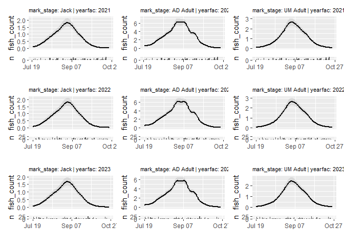
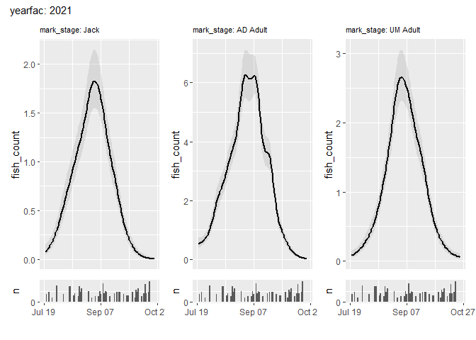
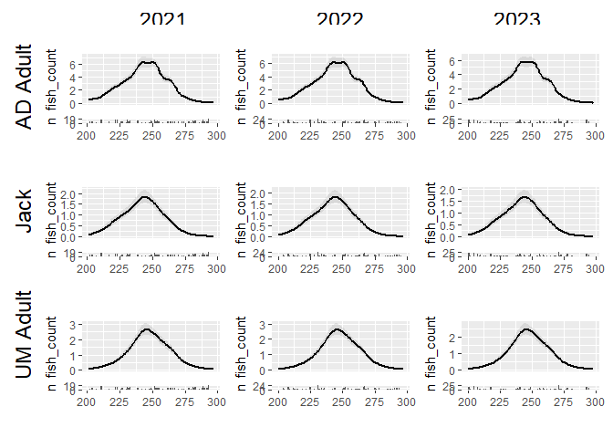
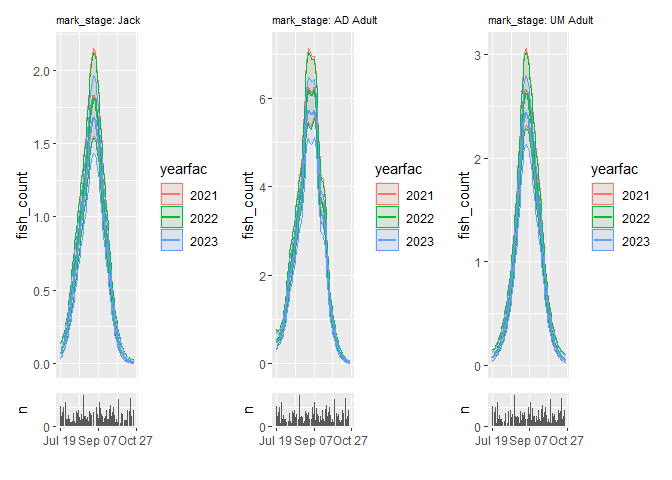

<!-- README.md is generated from README.Rmd. Please edit that file -->

# VizSeasonalGams

<!-- badges: start -->
<!-- badges: end -->

The goal of VizSeasonalGams is to streamline plotting fitted gams that
incorporate a seasonal component (e.g., smooths across day of year).
While the tools here can work for models that include a smooth of
interest across any continuous variable, this documentation will default
to assuming the data and model include `"doy"` which contains day of
year.

## Installation

You can install the development version of VizSeasonalGams from
[GitHub](https://github.com/) with:

``` r
pak::pak("cbedwards-dfw/VizSeasonalGams")
```

## Example

Generate some simulated data akin to the kind of fish data this package
was developed for, and fit a gam model to it:

``` r
library(VizSeasonalGams)
library(mgcv)
#> Warning: package 'mgcv' was built under R version 4.4.3
#> Loading required package: nlme
#> This is mgcv 1.9-3. For overview type 'help("mgcv-package")'.
library(tidyverse)
#> Warning: package 'ggplot2' was built under R version 4.4.3
#> Warning: package 'lubridate' was built under R version 4.4.2
#> ── Attaching core tidyverse packages ──────────────────────── tidyverse 2.0.0 ──
#> ✔ dplyr     1.1.4     ✔ readr     2.1.5
#> ✔ forcats   1.0.0     ✔ stringr   1.5.1
#> ✔ ggplot2   3.5.2     ✔ tibble    3.2.1
#> ✔ lubridate 1.9.4     ✔ tidyr     1.3.1
#> ✔ purrr     1.0.2
#> ── Conflicts ────────────────────────────────────────── tidyverse_conflicts() ──
#> ✖ dplyr::collapse() masks nlme::collapse()
#> ✖ dplyr::filter()   masks stats::filter()
#> ✖ dplyr::lag()      masks stats::lag()
#> ℹ Use the conflicted package (<http://conflicted.r-lib.org/>) to force all conflicts to become errors

data.sim = simulate_data()

out = gam(fish_count ~ mark_stage +
            s(doy, by = mark_stage, k = 20) + 
            yearfac,
          method = "REML",
          family = "nb",
          data = data.sim)
```

`simulate_gam()` combines these two steps, but it seems valuable to have
the model structure visible.

`VizSeasonalGams` package provides two key tools for working with fitted
gam models that smooth across day of year. `plot_seasonal_gam_panels()`
creates a tibble, where each row is a unique combination of the levels
of all factors represented in the model. The `$plot` column contains a
plot of the gam predictions for that combination of factors, setting any
numeric predictaors aside from “doy” (or other specified `plot_across`
variable) to their median. This allows easy exploration of the
predictions of complex models over complex data.

`grid_panels()` (and to a lesser extent `wrap_panels()`) take the output
of `plot_seasonal_gam_panels()` OR a subset thereof (e.g., filtering to
levels of interest) and plots them as a grid or as panel. Think of them
as analogs to facet_grid() and facet_wrap(), but for working with gam
predictions generated by `plot_seasonal_gam_panels()`.

### Create a dataframe of predictors and prediction panels

``` r
prediction_panels = plot_seasonal_gam_panels(out)
#> → `color_by` not provided. Defaulting to no color.
#> → Options for `color_by`: mark_stage and yearfac.
prediction_panels
#> # A tibble: 9 × 3
#>   mark_stage yearfac plot      
#>   <fct>      <fct>   <list>    
#> 1 Jack       2021    <patchwrk>
#> 2 AD Adult   2021    <patchwrk>
#> 3 UM Adult   2021    <patchwrk>
#> 4 Jack       2022    <patchwrk>
#> 5 AD Adult   2022    <patchwrk>
#> 6 UM Adult   2022    <patchwrk>
#> 7 Jack       2023    <patchwrk>
#> 8 AD Adult   2023    <patchwrk>
#> 9 UM Adult   2023    <patchwrk>
```

### Plot all prediction panels

We can simply wrap the panels:

``` r
wrap_panels(prediction_panels)
```



This suits filtering our predictions to some cases of interest:

``` r
prediction_panels |> 
  filter(yearfac == "2021") |> 
  wrap_panels()
```



If we have at least two factor predictors, we can plot a grid of these
panels. Make sure to specify the variable names that define rows and
columns!

``` r
prediction_panels |> 
  grid_panels(column_var = "yearfac", row_var = "mark_stage")
```



We can also provide a “color by” variable to `plot_seasonal_gam_panels`;
this will put additional information on each panel and reduce the number
of panels. Because this reduces the dimensionality of
`plot_seasonal_gam_panels()` output, it may make it impossible to use
`grid_panels()` (ie only 1 factor predictor to plot by). `wrap_panels()`
is a flexible solution.

``` r
plot_seasonal_gam_panels(out, color_by = "yearfac") |> 
  wrap_panels()
```


